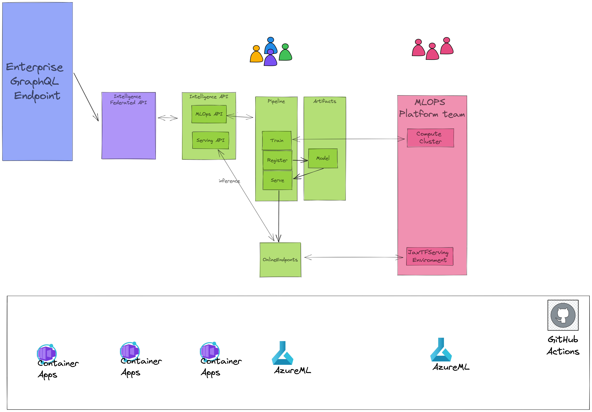

# Building innovative applications: Team Topologies, MLOps with Jax/Flax and the Enterprise Graph with GraphQL

We are going to put wayyyyyyyyyy to much effort in building a sequence-to-sequence neural network that can add two digits together. As there is so much buzz in the industry about team topologies, AI/ML and GraphQL, we are going to touch on all of these topics. This repository tries to provide a practical example for you to get started with.
In particular, I'll show you how:
- A platform team can facilitate a Data Science team by providing standard artifacts for serving Jax/Flax models in production with TF-Serving.
- How to expose an internal API used by the MLOps team retrain machine learning models and provide model serving.
- How to build a federated graphQL instance which integrates with a single, shared GraphQL gateway to provide API consumers with a standardized way of accessing intelligent capabilities.

Getting the initial environment up should take about 15 min. An additional 45 minutes are needed to train a Flax Neural Network and serve it with Tensorflow Serving on AzureML.

- For more information on [(Federated) GraphQL](https://github.com/Sruinard/federated-graphql)
- For a crash course on Flax/Haiku/Jax checkout [Machine Learning Novice](https://github.com/Sruinard/machine_learning_novice)
- For more information on why to adopt [Flax/Jax](https://github.com/Sruinard/jax_as_your_deep_learning_framework)
- For more information on [Team Topologies](https://teamtopologies.com/)
- For more information on [Container Apps](https://teamtopologies.com/)

## Deploying this application to Azure

1. Create a resource group:
   `az group create --name <resource-group-name> --location <location>` and add your resource group name to line 8 in [cicd_ml_platform.yaml](./.github/workflows/cicd_ml_platform.yaml)

2. create a service-principal and add the content of this command as a secret in your github
   repository called AZURE_CREDENTIALS. We need owner role on the Subscription (and not on the resource group) as our CICD pipeline will register the Azure Container Apps provider.

```
az ad sp create-for-rbac --name "<insert-a-name-for-sp>" --role owner \
    --scopes /subscriptions/<subscription-id> \
    --sdk-auth
```

3. push your code and validate the CICD pipeline succesfully deployed the application.

4. navigate to the url of your restapi container app <your_url>/docs and make a POST request to /pipelines (this will kick off the MLOps pipeline). Check in your Azure ML if the pipeline run has successfully run.

5. after deployment, go to your gateway container app instance and explore the capabilities or run
```
# Write your query or mutation here
mutation {
  compute(digit1: 20, digit2: 30){
    outputs
  }
}
```

## Directory structure

```
alphabrain
├── alphabrain
│   ├── app.py # internal API
│   ├── graphql_api.py # contains federated GraphQL API
│   └── mlops # code for training and deploying Deep Learning model to Azure ML
├── gateway # combines multiple federated GraphQL instances into a single enterprise Graph
└── iac # infrastructure for multiple teams
    ├── fusion_team
    └── ml_platform_team
```

## The application we'll develop

The following is a visual representation of the application we'll build.



As you can see, we have two types of teams. 
1) A stream aligned team with a frontend developer (orange), an graphQL facilitator (blue), a software engineer (purple) and a ML engineer (green). 
2) A ML Platform team with platform engineers (red).

The platform team provides X-as-a-service to the stream aligned team. In our case this represents a compute cluster and a tf-serving environment for deploying Jax deep learning models. You can see in platform team infrastructure that we build the serving image and AzureML compute environment and that this compute cluster and serving image are consumed by the stream aligned team to run their machine learning models in production.

To make life easier for you, I have setup everything with CICD-pipelines and Infrastracture as Code (IaC).

